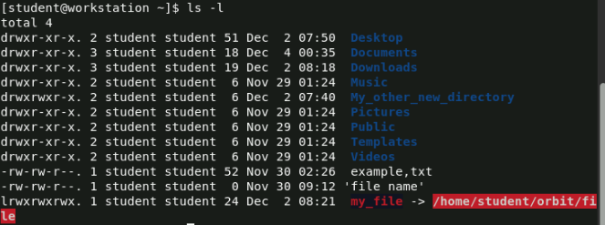
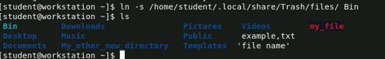

# Manipulating Files and Directories

## Creating a directory
```
mkdir Documents/Work
```
This will create the subdirectory 'Work' in the directory 'Documents'
## View the directory tree
```
tree Documents/
```
This will output the tree for 'Documents' directory


## Create a new file in a directory
```
touch Documents/Work/test.txt
```

## Move a file to another directory
```
mv Documents/Work/test.txt Documents
```

## List all the contents of a directory
```
ls Documents/
```

## Move a file and change the name of the file simultaneuosly
```
mv Documents/test.txt Documents/Work/myfile.txt
```

## Find a file by using its name (not case-sensitive)
```
find -name myfile.txt
```

## Find a file by using its name (case-sensitive)
```
find -iname myfile.txt
```

## Output long list of files in a current directory
```
ls -l
```


## Create a symbolic link to a specific file
```
ln -s /home/student/.localshare/Trash/files/ Bin
```


## Output the contents of a text file
```
cat Documents/test.txt
```